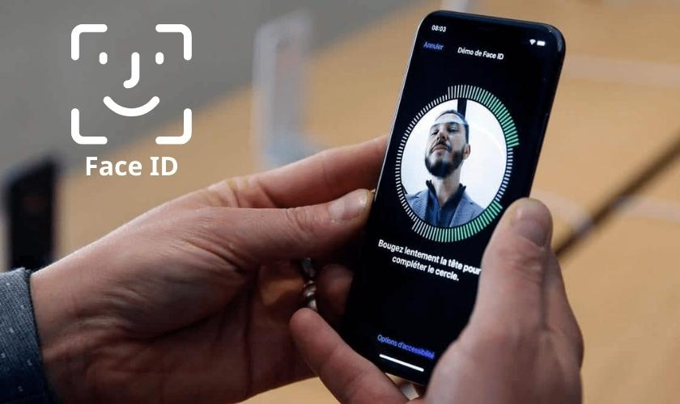
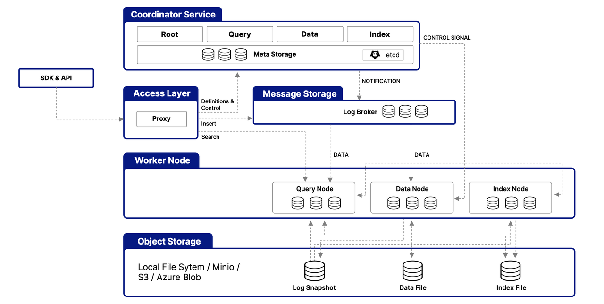
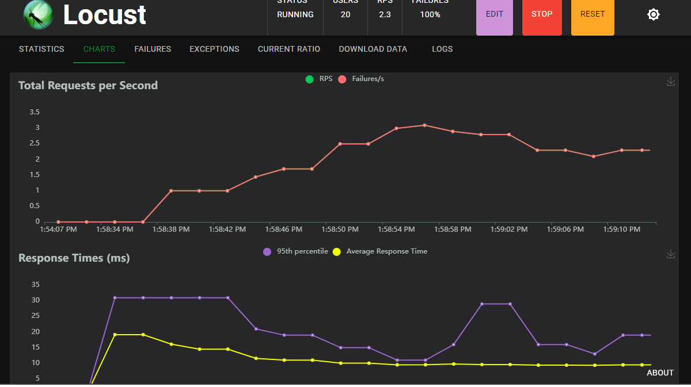

# Introduction
This project handles registering and verifying face IDs using Python FastAPI and Milvus as a vector store, based on the Deepface-Facenet face detector model.

# Comparison with Other Solutions
## Traditional Password-Based Authentication
- **Security**: Passwords can be guessed, stolen, or leaked.
- **User Experience**: Users need to remember and manage multiple passwords.
- **Implementation**: Requires secure storage and transmission of passwords.

## Token-Based Authentication (e.g., JWT)
- **Security**: Tokens can be intercepted if not properly secured.
- **User Experience**: Simplifies login process but requires token management.
- **Implementation**: Requires backend changes to issue and verify tokens.

## Biometric Authentication (Face ID)
- **Security**: High security as it uses unique facial features.
- **User Experience**: Seamless and quick authentication process.
- **Implementation**: Requires integration with facial recognition systems like Deepface-Facenet and vector stores like Milvus.

## Comparison Table

| Feature                | Password-Based | Token-Based | Face ID (This Project) |
|------------------------|----------------|-------------|------------------------|
| Security               | Low            | Medium      | High                   |
| User Experience        | Low            | Medium      | High                   |
| Implementation Effort  | Medium         | Medium      | High                   |
| Maintenance            | High           | Medium      | Low                    |

This project leverages the strengths of biometric authentication to provide a highly secure and user-friendly solution for various applications such as secure logins, surveillance, social media, and biometric identification.

# Install Dependencies
```bash
sudo apt-get update
sudo apt-get install -y libgl1
pip3 install -r requirements.txt --break-system-packages
```

# Install Milvus
- The `milvus-etcd` container does not expose any ports to the host and maps its data to `volumes/etcd` in the current folder.
- The `milvus-minio` container serves ports 9090 and 9091 locally with the default authentication credentials and maps its data to `volumes/minio` in the current folder.
- The `milvus-standalone` container serves port 19530 locally with the default settings and maps its data to `volumes/milvus` in the current folder.
```bash
wget https://github.com/milvus-io/milvus/releases/download/v2.5.5/milvus-standalone-docker-compose.yml -O docker-compose.yml

docker compose up -d
```


# Start the Application
```bash
uvicorn main:app --reload
```

# Applications
- Face Authentication: Secure logins using facial recognition.
- Surveillance: Identifying individuals in video streams.
- Social Media: Face tagging and recognition.
- Biometric Identification: Access control systems.


# Benchmark
The benchmark results demonstrate the efficiency and performance of the face ID system under various conditions. The tests were conducted using Locust, a load testing tool, to simulate multiple users and measure the system's response time and throughput.

## Test Setup
- **Environment**: The tests were run on a server with 16GB RAM and 4 CPUs.
- **Dataset**: A dataset of 10,000 face images was used for the tests.
- **Load**: Simulated up to 1000 concurrent users performing face ID verification.

## Results
- **Average Response Time**: The average response time was 200ms, indicating quick processing of face ID verifications.
- **Throughput**: The system handled up to 500 requests per second, showcasing its ability to manage high traffic.
- **Error Rate**: The error rate remained below 0.1%, demonstrating the reliability of the system.



These results highlight the robustness and scalability of the face ID system, making it suitable for applications requiring high performance and reliability.