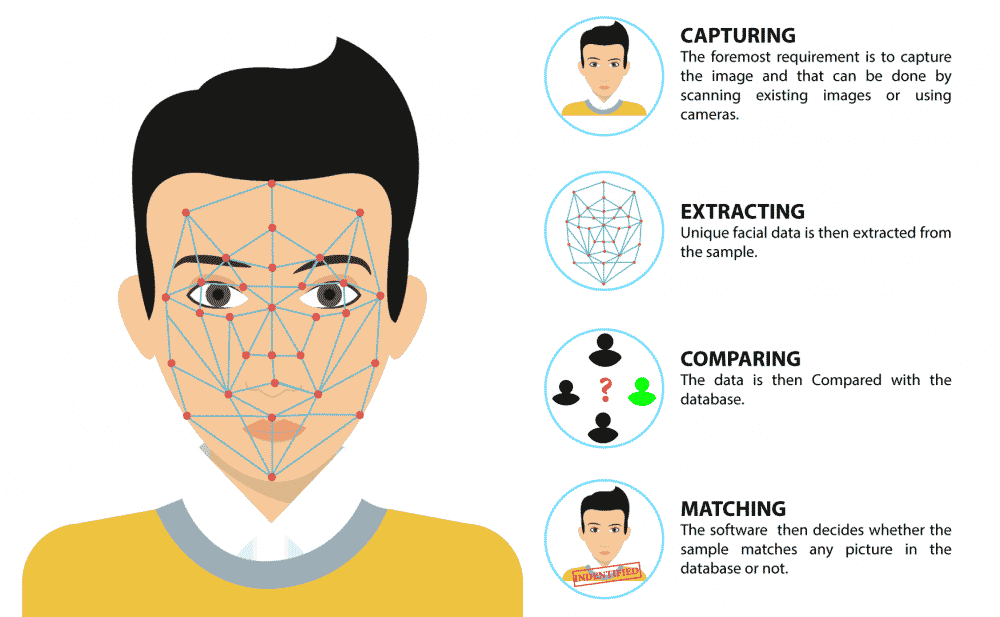

# Face Detection using C++ and ZeroMQ
This project face detection using OpenCV and ZeroMQ in C++. It provides a simple and efficient way to detect faces in images or video streams.

## Features

- **Real-time Face Detection**: Utilizes OpenCV's powerful face detection capabilities.
- **Message Passing**: Uses ZeroMQ for efficient message passing between different components.
- **Cross-Platform**: Can be built and run on various operating systems.

## Architecture and Workflow

The architecture of this project is designed to be modular and efficient. Below is an overview of the workflow:

1. **Image/Video Input**: The system takes images or video streams as input.
2. **Preprocessing**: The input data is preprocessed to enhance face detection accuracy.
3. **Face Detection**: OpenCV's face detection algorithm is applied to detect faces in the preprocessed data.
4. **Message Passing**: Detected face data is sent to other components using ZeroMQ.
5. **Postprocessing**: The received data is postprocessed to highlight detected faces.
6. **Output**: The final output is displayed or saved, showing the detected faces.


## Prerequisites

Ensure you have the following installed on your system:

- C++ compiler (e.g., g++)
- OpenCV library
- ZeroMQ library
- Docker (optional, for containerized execution)

## Installation

First, update your package list and install the required dependencies:

```bash
sudo apt update && sudo apt upgrade -y
sudo apt install libzmq3-dev libopencv-dev
```

## Build and Run

To compile and run the code, use the following commands:

```bash
g++ main.cpp -o main `pkg-config --cflags --libs opencv4` -lzmq
./main
```

## Docker

You can also build and run the project using Docker:

```bash
docker build -t face_detector_cpp .
docker run --rm -it face_detector_cpp
```

## Usage

After building the project, you can run the executable to start detecting faces. The program will process images or video streams and highlight detected faces.

## Pros and Cons

### Pros
- **High Performance**: Efficient face detection in real-time.
- **Scalability**: Easily scalable using ZeroMQ for message passing.
- **Cross-Platform**: Compatible with multiple operating systems.

### Cons
- **Complex Setup**: Requires installation of multiple dependencies.
- **Resource Intensive**: High computational power needed for real-time processing.
- **Limited Documentation**: May require additional research for troubleshooting.

## Contributing

Contributions are welcome! Please fork the repository and submit a pull request with your changes.

## License

This project is licensed under the MIT License.

